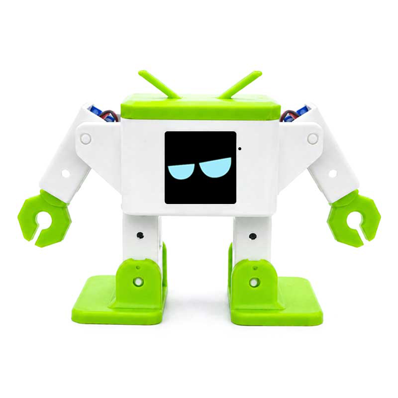

# Spotpear ESP32-S3 dancing robot: fixing the silent microphone

<p align="center"></p>

This is a fix for the **Spotpear ESP32-S3-AI-Robot-(A)**, an Otto-style dancing robot that runs [xiaozhi-esp32](https://github.com/78/xiaozhi-esp32) firmware. The board silkscreen reads "Robot v2.2 2026/06/24".

## The problem

Every stock xiaozhi `otto-robot` firmware (v2.1.0, v2.4.2, v2.5.0, OttoDIY builds) gets as far as the *listening* state and then never recognises any speech: no `>>` transcription appears in the log. The speaker works, but the mic only returns silence.

## The cause

The onboard MEMS mic is a **PDM** microphone:

| Signal   | GPIO |
|----------|------|
| PDM CLK  | 5    |
| PDM DATA | 6    |

The stock `NON_CAMERA_VERSION_CONFIG` drives it as a **standard I2S** mic (WS=4, SCK=5, DIN=6), so the samples are always zero. The speaker pins are correct as they are: DOUT=7, BCLK=15, LRCK=16.

I found the pins with the scanner in [`micscan/`](micscan). It plays a 1 kHz tone through the speaker, then tries PDM and standard-I2S pin combinations on I2S0 and ranks each one by how much of its signal is at 1 kHz. `PDM clk=5 din=6` scored a 1 kHz energy ratio of **1.000**. No standard-I2S combination scored above 0.004.

## The fix

[`xiaozhi-patch/otto-robot-pdm-hirobo.patch`](xiaozhi-patch/otto-robot-pdm-hirobo.patch) applies to xiaozhi-esp32 **v2.5.0**. It:

- switches the no-camera Otto board to the existing `NoAudioCodecSimplexPdm` codec (CLK=5, DATA=6);
- replaces the default "你好小智" wake word with a custom English wake word, **"Hi Robo"**, using the MultiNet6 English model (`mn6_en`), threshold 20%.

## Flashing the prebuilt firmware

```bash
esptool --chip esp32s3 --port /dev/ttyACM0 erase-flash
esptool --chip esp32s3 --port /dev/ttyACM0 write-flash 0x0 firmware/otto-xiaozhi-2.5.0-pdm-hirobo-merged.bin
```

Then set up Wi-Fi:

1. Join the robot's `Xiaozhi-XXXX` access point.
2. Open http://192.168.4.1 and enter your Wi-Fi details.
3. Activate the device on xiaozhi.me.
4. Say **"Hi Robo"**.

Writing the merged image at `0x0` wipes the saved Wi-Fi settings. To keep them when you re-flash, flash the individual images with `write-flash @build/flash_args` from a build tree.

Turn off OTA for the device in the xiaozhi.me console. Otherwise an update will bring back the silent-mic firmware.

| File | SHA-256 |
|------|---------|
| `otto-xiaozhi-2.5.0-pdm-hirobo-merged.bin` | `76c235dd2bacc3f753633cb055487e79efb61739355d94bdd5860e650d83f7e3` |
| `micscan-merged.bin` | `c334ba1790653e03a67f2ef0a5b4fc7080df8c0ecd9ebbeae6265f67b2c4940c` |

## Building from source

xiaozhi v2.5.0 needs **ESP-IDF ≥ 6.0.1**. I tested it with v6.0.3.

```bash
curl -LO https://github.com/78/xiaozhi-esp32/archive/refs/tags/v2.5.0.zip
unzip v2.5.0.zip && cd xiaozhi-esp32-2.5.0
patch -p1 < ../xiaozhi-patch/otto-robot-pdm-hirobo.patch
. $IDF_PATH/export.sh
python scripts/build.py otto-robot      # -> build/merged-binary.bin
```

## Running the mic scanner on another board

The scanner builds with ESP-IDF v5.5 or later:

```bash
cd micscan
idf.py set-target esp32s3 build
idf.py merge-bin -o micscan-merged.bin
esptool --chip esp32s3 --port /dev/ttyACM0 write-flash 0x0 build/micscan-merged.bin
```

Open the USB serial console at any baud rate. The scan takes about 2–3 minutes (up to 10 if it has to do the full sweep). When it finishes, it prints a top-10 ranking, then streams live RMS levels from the best combination so you can clap or talk to confirm it. Before you run it on a different board, edit `cand[]` and the speaker pins in `micscan.c`.

## Hardware notes (no-camera version)

- **Servos:** left leg 17, right leg 39, left foot 18, right foot 38, left hand 8, right hand 12
- **Display (ST7789, 240×240):** BL 3, MOSI 10, CLK 9, DC 46, RST 11, CS 12
- **Charge detect:** 21
- **BOOT button:** 0
- **Console:** native USB-Serial/JTAG (303a:1001)
